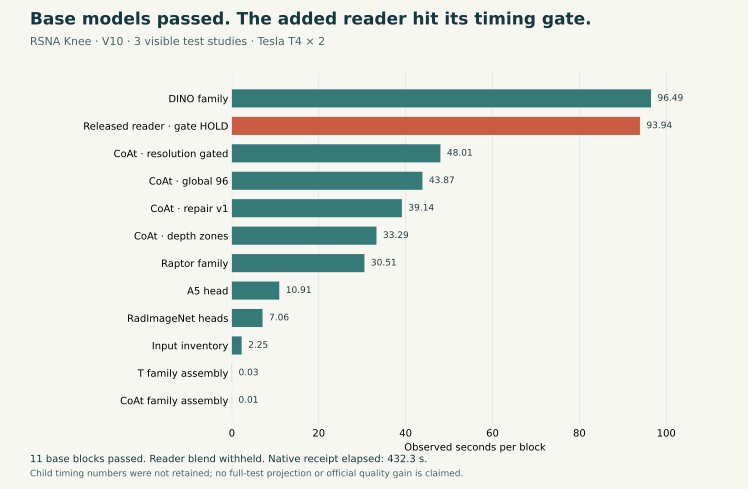
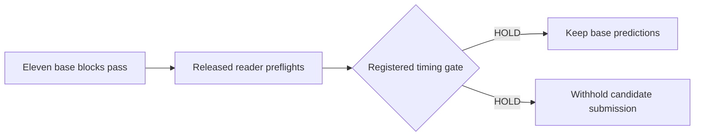

# What stopped the released reader in our Knee run

Version 10 completed all eleven original base blocks, then withheld the added ConvNeXt reader because its registered timing gate failed. The reader contributed no predictions to the final blend. This run is a failed candidate preview, with no new official score.

The native receipt records **432.3 seconds** across three visible test studies on two Tesla T4 GPUs. DINO took 96.49 seconds; the reader hook took 93.94 seconds before raising its timing exception. These block observations do not establish performance over the full competition test set.

## The evidence gap

The reader was allowed 5,400 seconds, including 900 seconds of headroom. The exact timing exception is downstream of both child coverage/oracle checks in the pinned source. That is a control-flow inference: the child numerical receipts were under temporary scratch storage and did not survive into the saved Kaggle outputs. We therefore cannot report the oracle error, cold-start cost, per-batch cost, or projected full-test reader runtime.

The outer receipt also left `extra_family` at `not_run` after the exception. This does not mean the hook never executed: its measured block cost and terminal exception establish that it did. The base CSV passed schema, ID-order and finite-probability checks, but the candidate's final gate stayed **HOLD**.

## What the next diagnostic must resolve

The next diagnostic retains child logs, configs, coverage and receipts before failures and copies the reader receipt on the failure path. It keeps the same trained weights, geometry, frozen 32-study timing cohort, oracle, blend weight and timing rule. Measurements are needed before deciding whether startup is being amplified by the conservative projection or whether sustained inference is too slow. Neither explanation is established by V10.

The plotted measurements and source/evidence hashes are in [measured-data.json](measured-data.json). The released reader comes from [goodpjw2008's trained reader dataset](https://www.kaggle.com/datasets/goodpjw2008/rsna-knee-2-5d-convnext-reader); our private validation run is [the preserved V10 notebook](https://www.kaggle.com/code/prvsiyan/bee-s-knees-rsna-knees-final-push/10). The notebook link requires the owner's access. No competition images, labels, predictions, weights or third-party code are included in this report.

## Reproduce the figure

With Python and Matplotlib installed, run `python render.py --output-dir ./new-render` from this folder. The script reads only the public scalar JSON and writes SVG/PNG files to a new directory. It runs no model and needs no Kaggle credentials or competition data.
