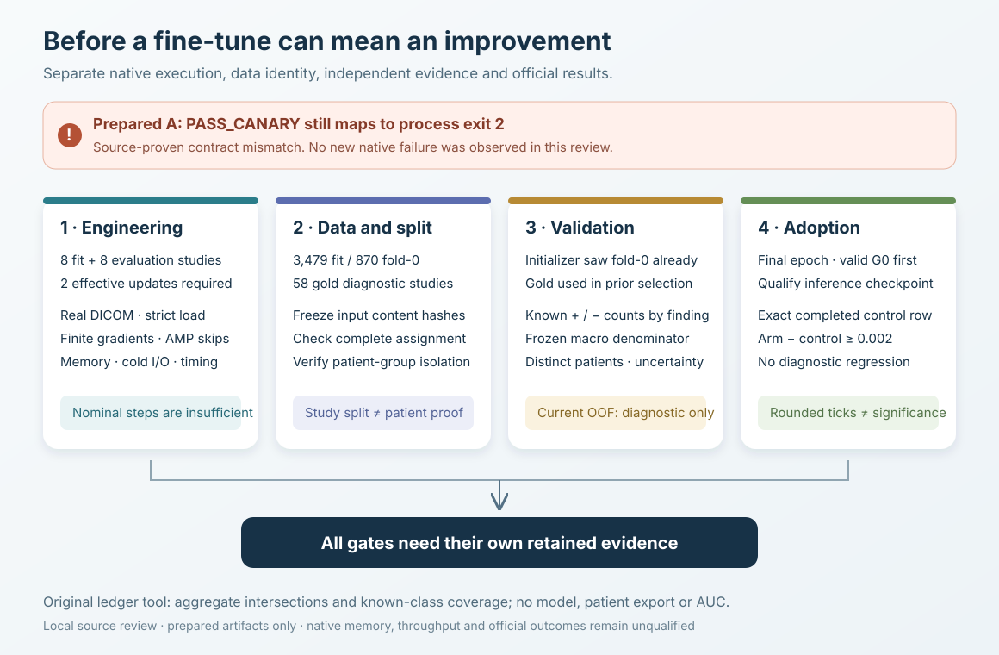

# Before a knee fine-tune can mean an improvement

This is an independent source review of four prepared RSNA Knee fine-tune sessions. It identifies work needed before spending the training budget and gives a small, original tool for checking a private split ledger. No model was run, no competition data was copied, and no notebook, dataset or submission was changed. The only executed check in this packet uses invented ledger rows and ordinary CPU Python.



## The immediate engineering blocker

The prepared A canary returns `PASS_CANARY` when its checks succeed, but its first active script entrypoint exits successfully only for `PASS_TRAINED`. A successful inner canary therefore exits with code 2. This is a source-proven mismatch, not an observed new Kaggle failure. The preserved older entrypoints occur after an unconditional exit and cannot correct it.

The scheduling wrapper also needs careful interpretation: a terminal kernel `ERROR` can still be followed by wrapper exit 0 after outputs are collected. A shell exit receipt, a training receipt and Kaggle's native terminal status answer different questions. The compute coordinator should resolve this contract before launching A; this review did not edit or stop the queued workflow.

The A source is bound to SHA256 `824a72ccf390745c0fa82d0a1457a190472059c4387f7fb9539de8b7cf7727b9`. In that exact source, lines 849–858 produce the canary receipt and lines 873–877 determine process exit. This binding describes the prepared source reviewed here; it does not certify a future modified source or accepted server version.

## What each session is designed to establish

| Session | Fit / evaluation studies | Epochs and nominal optimizer steps | Soft / hard / session caps | Evidence still needed |
|---|---:|---:|---:|---|
| A, control canary | 8 fit, 8 evaluation | 1 epoch, 2 steps | 420 / 600 / 900 s | Real DICOM access, strict real initialization, CUDA/AMP behavior, memory and timing |
| B, control | 3,479 fit, 870 fold-0, 58 gold | 3 epochs, 434 steps per epoch | 8,400 / 9,000 / 9,300 s | Full engineering gates and a valid control comparison |
| C, gemlow | Same split as B | Same schedule | Same caps | Label and prevalence-weight intervention against B |
| D, lexblend | Same split as B | Same schedule | Same caps | Disagreement-rule intervention against B |

These counts are the frozen design's cohort, not a fresh runtime measurement. With micro-batch 2 and accumulation 4, `floor(floor(3479/2)/4) = 434`: each full epoch uses 3,472 studies, dropping seven through loader and accumulation boundaries. A changes accumulation to 2, giving two steps from eight studies. Planned step counts must be compared with effective optimizer updates.

The source increments its step count and advances its scheduler after `GradScaler.step`. AMP may skip an optimizer update when gradients are nonfinite, so finite mean loss plus two counted steps cannot prove two updates. A meaningful native canary should record finite gradients, overflow/skipped-step evidence and an actual parameter change. CPU checks with random initialization do not certify this CUDA path.

B/C/D currently return `PASS_TRAINED` without enforcing every design G0 predicate. A future coordinator must separately check expected effective steps, finite losses/weights, failure rates and checkpoint hashes. Training build-failure counters are accumulated but are not exported as a complete full-arm failure ledger; a green status alone does not establish the proposed 0.5% limit.

## Split isolation and initialization exposure are separate

The prepared fold function partitions `StudyInstanceUID`, and the intersection checks cover studies. They do not establish patient separation. A person can contribute multiple studies or knees; a private patient-group map is needed to verify separation and compute an effective independent sample count. This review found no evidence proving an actual patient leak; the isolation claim remains unproven.

Missing fold assignments are silently excluded through a default fold of -1. A source/data manifest should therefore assert the expected fit, held and gold cohorts, complete assignment coverage, and a private ordered split digest. The base checkpoint has a pinned SHA256 and strict full state loading; label tables, fold assignments, competition metadata and DICOM input files currently lack equivalent content bindings. Dataset attachment names alone do not freeze those bytes.

The selected initializer was trained on all 4,349 non-gold studies, including the 870 fold-0 studies. Excluding fold 0 during this fine-tune cannot undo its earlier exposure. Fold-0 AUC is a non-regression diagnostic against weak report labels, not independent held-patient validation. The publisher also records that Gold58 was reused for checkpoint selection. Calling gold diagnostic in this new experiment does not restore its independence.

Maintain a separate upstream inventory for initializer training cohorts, external supervision and checkpoint selection. Study and patient overlap inventories need to include previous exposure, not merely the new fit split. A checkpoint byte hash proves which initializer was used; it does not prove that initializer was blind to evaluation data.

## Known-label coverage and the macro denominator

The active loss is weighted BCE over all 12 finite soft report targets. Its window/slice masks control image construction; they are not known-label masks in the training loss. The initializer's historical masked OAI supervision does not establish masking in this fine-tune. Soft-target training is legitimate as an experiment, but missing independent truth must not be relabeled as a negative outcome.

The AUC function thresholds the control weak labels at 0.5 and silently skips findings without both classes. Its macro is the mean over the remaining findings, or NaN when none remain. An eight-study canary cannot automatically support a 12-finding validation claim. Record known positive, known negative and unknown counts per finding, distinguish study counts from independent patients, and freeze the same supported finding set for a before/after comparison. A supported-subset macro should be named as such.

Each label arm recomputes its BCE prevalence weights from its own targets. Consequently C/D change targets and loss weights together. Report that joint intervention unless a different controlled experiment is explicitly designed; it does not isolate only label replacement.

## Runtime, stopping and adoption

The soft timer is checked during training micro-batches. Base evaluation, gold evaluation and final evaluation are outside that soft check. The hard watchdog starts after dependency setup, writes a receipt and terminates the process. A session can therefore hit its hard cap during evaluation or checkpoint writing; dependency startup also needs to fit the whole session envelope.

The earlier central design estimate was 9,600 seconds per full arm, above the prepared 8,400-second soft and 9,000-second hard caps. The caps are promises to stop, not evidence that the experiment will finish. A canary needs separate cold preparation, model loading, optimizer-update and evaluation timings; a full-cohort estimate needs real I/O variation and headroom. The hard caps total 27,600 wall seconds for A plus three arms, and the session timeouts total 28,800 seconds. Quota multipliers and available reservations must be verified by the compute coordinator; these sums are not a claim about live remaining quota.

The saved epoch checkpoint contains model weights and metadata, without optimizer, AMP scaler, scheduler, RNG or sampler state. A restart from the base is a new training trajectory, not faithful continuation. Interrupted files and receipts need completeness checks before reuse.

The declared adoption rule uses the final epoch only: valid G0 evidence, a control official score in [0.948, 0.950], then arm-minus-control at least 0.002 while its fold-0 diagnostic does not decline. Rounded public scores do not establish statistical significance. The inference adaptation to each new checkpoint also needs a separately reviewed hash-bound path and runtime qualification. No native, hidden or official score is established by this packet.

## A small reusable private-ledger check

`audit_split_coverage.py` is original standard-library code. It checks study/patient intersections, an explicit upstream exposure inventory, known binary-truth coverage, held-set checkpoint selection and effective update counters. It emits only aggregate counts, finding indices and named holds. It does not emit input identifiers or predictions, calculate AUC, establish confidence intervals, inspect real weights, or verify the honesty/completeness of an inventory supplied by its caller.

Run the synthetic controls locally:

```sh
python3 audit_split_coverage.py --self-check
```

For a private ledger, use `--ledger private-ledger.json`. Required fields are `findings`, `rows`, explicit `initialization_exposed_study_tokens` and `initialization_exposed_patient_tokens` lists, `initialization_exposure_inventory_complete`, `held_used_for_checkpoint_selection`, and `engineering`. Each row has `split` (`fit` or `held`), study/patient tokens, binary `truth_labels` and boolean `known_mask`. Engineering counters must be genuine nonnegative integers; booleans do not count as updates. Unknown truth is excluded from positive/negative coverage. Keep the input ledger private.

`independent_evaluation_ready` means only that these declared ledger invariants passed. It is separate from `engineering_pass`, and neither is an AUC or score certificate. The engineering flag uses a strict zero-build-failure canary policy; it does not implement the full arm's proposed 0.5% allowance. The synthetic receipt contains twelve invented controls, including study-disjoint patient overlap, initializer exposure, missing class support and nominal AMP steps without updates. All twelve passed in one normal-Python invocation on the independently reviewed source, using approximately 0.0085 CPU seconds. See `REVIEW_NOTE.md` for the exact source and proof bindings.

## Provenance and safe publication

The reviewed sources are preserved local prepared A/B/C/D artifacts, their build/override receipts, the frozen fine-tune design, its active template and the scheduling wrapper. Exact local bindings are retained separately for coordinator review. Candidate hashes are A `824a72cc…`, B `40fc8d46…`, C `09654b5e…`, and D `4496618c…`; they identify this review's inputs and are not server-acceptance receipts.

The initializer is nartaa's `raptor_ft_alldata_t16_blendjev_oai_d96_r384_swa.pt`, pinned to `7e5315dad125b99fc65b340b3de41de628e9be51ff5835355dd61c86472244ef`. Its preserved publisher README permits research and competition use of the learned weights, retains third-party terms and grants no rights to OAI records. The inherited supervision and competition eligibility question require their own provenance review. This packet distributes original documentation, a diagram and a ledger utility, without weights, medical images, reports, patient identifiers or subject predictions.

Public allowlist: this README, `readiness_contract.svg`, `audit_split_coverage.py`, `SYNTHETIC_PROOF.json`, `PUBLIC_PREPARED_SOURCE_AUDIT.json`, `REVIEW_NOTE.md`, `NOTICE.md`, and `LICENSE`. Private source bindings, absolute local paths and coordinator handoff remain local. Root owns publication; Claude owns compute and submissions. Every existing notebook and identity artifact remains preserved.
