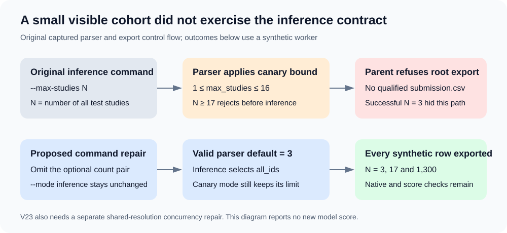

# Why a three-study inference check missed a hidden-rerun failure

The account reached **0.949** with the anatomical-mirror reader: public V34,
submission **56949940**, is recorded as `COMPLETE` with `publicScore="0.949"`.
The later plain-view V22 and four-view V23 experiments produced their visible
CSV successfully, but official submissions **57016738** and **57016750** ended
with missing-submission-file errors and no score. They did not measure the
quality of either proposed strategy.

This review found a deterministic command-line defect and a separate concurrency
defect. The proposed command patches are source-ready; an integrated successor,
native qualification and another official score are still outstanding.

## The count argument crossed two different contracts

The child command passed both `--mode inference` and `--max-studies N_STUDIES`.
The reader's argument validation requires `1 <= max_studies <= 16` regardless
of mode. Its inference branch then selects **all** study IDs, while the canary
branch uses the count limit. The supplied limit is unnecessary for inference.

With three visible studies, the command passes. With 17 or more studies, it
fails before inference begins. The parent correctly refuses to export a root
CSV from a failed owned worker. This source-level path is sufficient to produce
the observed missing-file outcome; the actual hidden traceback was unavailable,
so this report does not claim it directly observed that traceback.

The minimal repair omits `--max-studies N_STUDIES` from inference commands.
The valid default remains 3, and the unchanged inference branch still processes
every study. Canary count validation remains intact. The two attached diffs
change only this argument pair; model/checkpoint identity, prediction arithmetic,
budgets, cleanup, degradation checks, row order, schema and export gates remain
unchanged.

| Synthetic cohort | Original captured control flow | Command repair |
|---:|---|---|
| 3 studies | Exports 3 rows | Exports 3 rows |
| 17 studies | Rejects before inference; no root CSV | Exports all 17 rows |
| 1,300 studies | Rejects before inference; no root CSV | Exports all 1,300 rows |

These outcomes were checked for both V22 and V23 using their actual captured
parser, ID-selection expression, and parent export cells, with a clearly labeled
synthetic worker. Twelve recorded cases passed.
An independent reviewer verified the exact command-only AST delta and equality
between the analyzed candidates and their saved server cells.

These are control-flow checks. They establish no GPU performance, real prediction
correctness, hidden-set generalization or new leaderboard score.

## Four-view inference needs one more repair

V23 temporarily changes the shared reader's `INPUT_RES` from 320 to 384 while
two GPU consumer threads may run. A deterministic synthetic two-consumer schedule
reproduces a 320-resolution model receiving 384-resolution input. Serial and
namespace-isolated synthetic cases pass; neither substitutes for native testing.

Both actual visible runs recorded three `parity_reference` and three
`parity_candidate` predictions, with **zero post-parity main predictions**.
Thus the successful visible CSV never qualified the concurrent path. V23 remains
held until a source repair, serial-versus-concurrent prediction comparison and
runtime qualification have passed. Serialization may be a small correctness
repair, but its performance cost must be measured before adoption.

## Reproduction and integration

The attached diffs and `evidence.json` bind the command changes, source hashes,
observed official rows and synthetic outcomes. They contain no competition
inputs, study identifiers, predictions, checkpoints, credentials or signed URLs.
The full captured-source harness and independent review remain in the local
campaign evidence; the private notebook captures are not bundled here.

When reproducing in another reader, first verify its actual parser defaults and
inference selection. Do not apply a command edit solely because flag names match.
Then test a cohort above the canary limit and at least two post-parity consumers.
Integrate through a fresh identity-preserving notebook pull, retain old cells,
qualify the new source natively and bind any subsequent score to its exact row.

## Attribution and permission scope

This is original debugging and glue-patch analysis for the account's experiment.
The unchanged reader credits nartaa's licensed methodology. Apache code permission
and the publisher's separate checkpoint terms remain distinct; this packet
redistributes neither a model nor a competitor implementation. Existing reader,
data and model acknowledgments must remain in the notebook.

Source observation: 9 October 2026, 17:57:57 UTC. Result statements are historical
evidence, not a claim that an unobserved later submission succeeded.
