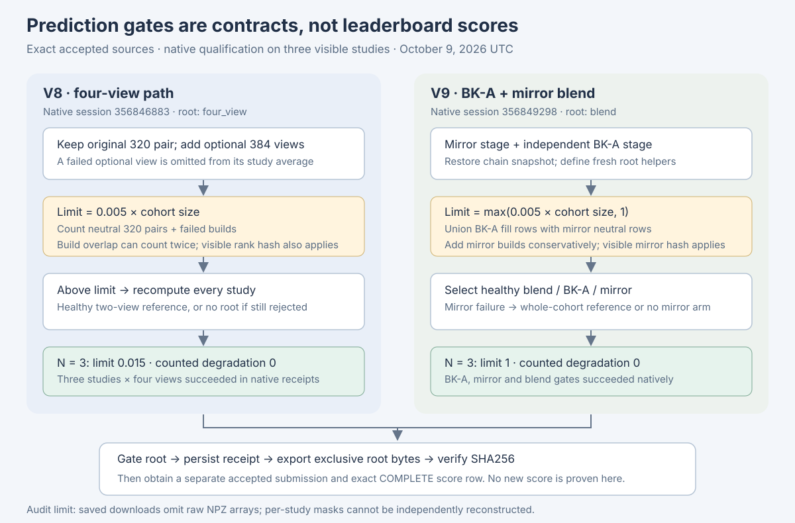

# What accepted V8 and V9 actually qualify

This review binds the accepted sources and saved native outputs of two private bench versions. It uses no hidden labels or prediction rows. Native success establishes that a source ran and passed its own visible gates; an official score requires a separate exact completed submission row. No new official score is established here. Claude remains the compute/submission coordinator; the saved ledger plans a once-only midnight queue in priority V9, V8, V6.

| Accepted version | Native session | Visible result | Counted degradation / absolute limit | Measured chain time |
| --- | --- | --- | --- | --- |
| V8 | 356846883 | PASS_V8_FOUR_VIEW; three studies, four views each | 0 / 0.015 | 70.53 s |
| V9 | 356849298 | PASS_V9_BLEND; BK-A and mirror healthy | 0 / 1 | 389.12 s |

V8 source SHA256: `783afeb1bc9b52324ec2866dfefe360bbb469a5b69eca36cf2b1bb9789b58064`. V9 source SHA256: `4552ea64e02c1930e647fdb383578571ecec9b9a7a8bc1804d6bb9a5697f782f`. Each captured server notebook's cell type, ID and source exactly matches its candidate. Both root CSV hashes match their saved native receipts. These are provenance bindings, not claims that three visible studies represent hidden-cohort runtime or performance.

## Export controls and helper isolation

V8's active four-view route does not execute the retained BK-A cells, so the earlier shared `_need` helper collision is outside its execution path. Its original 320 predictor is called before optional 384 views; an optional view exception omits that view while retaining the 320 pair. Three visible studies each produced all four views, with zero reported 384-view failures. Partial-view and two-view statuses are deliberately accepted: a later root labeled `four_view` can contain unequal view coverage, which must be read from the view-count receipt.

V9 snapshots the chain state before BK-A execution, restores it at G4, reimports its numerical libraries and defines fresh `_v9_*` helpers. The observed `_need=float` collision therefore does not govern final checks. BK-A receipt/schema/range/branch checks precede route selection. The root receipt is written before exclusive root creation; all selected routes require an under-limit count, and the exported bytes are checked against their SHA256. The mirror subprocess also requires owned-command success, no unresolved teardown and cleanup on success. Detailed returned teardown evidence is not copied into the chain receipt, so this review does not claim an independently reconstructed process-lifecycle audit.

## Limits and masks: scope matters

Accepted V8 has **no one-study floor**: its limit is `0.005*N`. V9 uses `max(0.005*N,1)`. At N=3 those are 0.015 and 1; at N=1300 both are 6.5. V9 therefore permits one covered degraded study on small cohorts; it is not a strict 0.5% fraction there. The visible mirror rank-hash check remains required despite the floor. Rank equality does not prove raw probability equality, and V9's BK-A path has no separate zero-degradation override for visible studies. Both actual visible runs reported zero covered degradation.

V8 counts the union of neutral plain/mirrored 320 rows and adds failed builds. V9 BK-A counts the distinct-study union of all-neutral final rows and any 0.5 fill in branch members. The production branch writer requires members shaped `[M,N,12]`; the parent correctly reduces the member and finding axes. V9's mirror and blended counts add scalar mirror builds to study masks, so overlapping build/neutral faults can count twice. These are conservative masks for covered defaults/builds, not universal imaging-fault masks. Header/pixel faults, missing slots and absent metadata are not independently included unless they trigger a covered failure. Optional 384 omissions are outside V8's 320 degradation numerator.

V8's visible hash check occurs before setting its candidate fail_closed flag. A visible rejection can therefore leave that flag false even though candidate acceptance and final export remain blocked or fall back correctly. Inspect candidate failure and root selection as well as the flag.

## Reproducibility gap and next useful evidence

V9 validates its mirror raw values as finite `[N,12]` and source/checkpoint/coverage identity. Both producers write UID-ordered arrays and labels. The parent gates do not fully bind NPZ UID/label fields and their byte hash to the staged CSV. Existing output-fetch filters omit `.npz`, so the saved receipt counts cannot independently reproduce the per-study masks; zero counts are native receipt observations. No raw competition arrays should be published.

The next useful private evidence is an exact source-bound artifact manifest for raw values, member arrays, UID/label ordering and distinct failure masks, plus the owned teardown receipt. That would let a reviewer reconstruct the observed gate counts without treating a valid rank CSV as proof of healthy probabilities. It does not require another candidate pipeline. For hidden-cohort assessment, preserve full native runtime/view coverage/fault receipts and wait for the exact completed official row. The historical 0.949 incumbent remains separate from these qualifications.

The ledger reports total commit completion at 90 s for V8 and 452 s for V9; these include overhead beyond the chain times above. Neither value demonstrates full hidden-cohort throughput. No tests, Kaggle APIs, launches, submissions, notebook changes or external writes were performed by this review.
