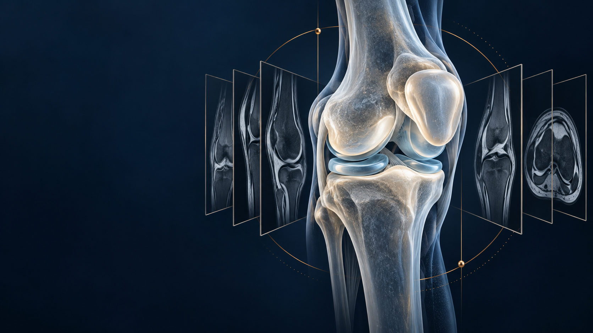

# Multi-view inference: what counts as a pass?

*Generated editorial artwork, not a patient scan or a measured scientific figure.*

The accepted V8 and V9 canaries completed with zero reported covered degradation. Their gates have different small-cohort limits; neither visible canary establishes a new official score. The companion [qualification guide](PUBLIC_QUALIFICATION_GUIDE.md) explains the exact sources, four-view recovery, blend export controls and limits of the saved evidence.

The original [contract diagram](qualification_contracts.svg) separates source, native execution and official scoring. Scientific numbers in that guide come from saved native receipts, not this cover illustration.

This is a new preserved asset. Incorporating it into a Kaggle notebook remains an identity-preserving coordinator action after the usual checks. It has not been inserted into a notebook by this publication.

The full generation prompt is in [COVER_PROMPT.md](COVER_PROMPT.md). The built-in imagegen tool generated the opaque PNG; no reference image, competitor artwork, clinical image or patient data was supplied. Documents, diagram and cover are offered under [CC BY 4.0](https://creativecommons.org/licenses/by/4.0/); credit cubres and retain the generated-art caption.
