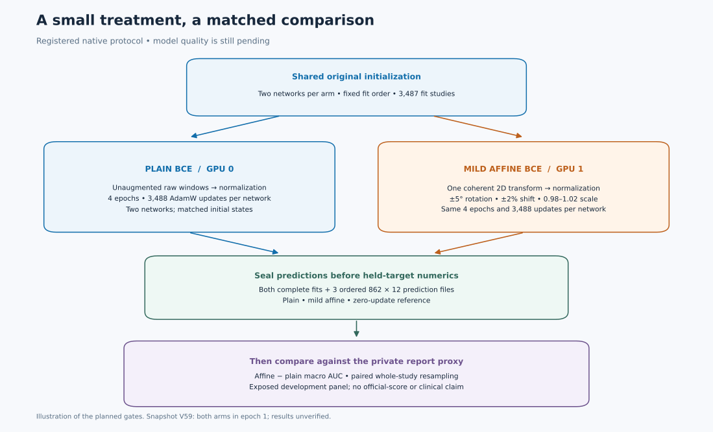
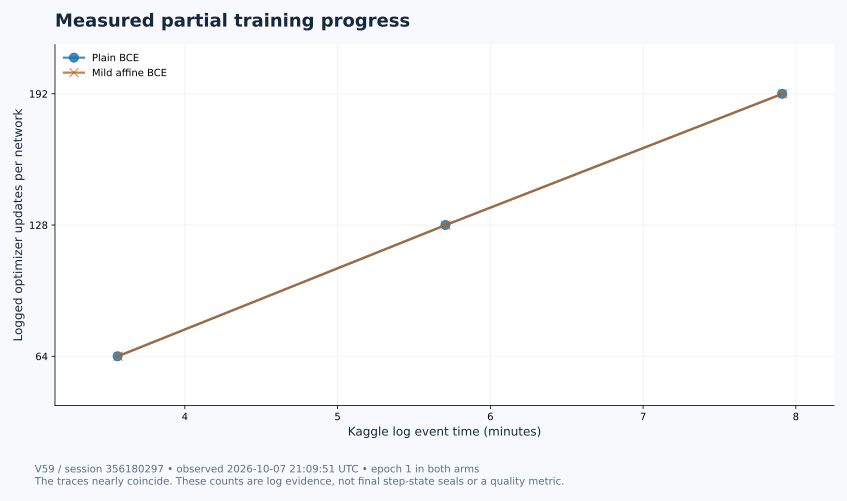

# Does a coherent mild affine help the knee student?

We are testing a small change with a controlled comparison: rotate, translate and scale each study consistently across its windows, then compare the final trained models against the same models trained on plain images. The two arms start from exactly shared initialized states and use the same fixed four-epoch schedule.

**Snapshot: 7 October 2026, 21:09:51 UTC.** Kaggle Version 59 was explicitly `RUNNING`; each of its four networks had logged **192 optimizer updates in epoch 1**. That is measured progress toward the registered 3,488 updates per network. No complete fit, three-way prediction seal, proxy AUC comparison or official competition score was available at this snapshot.



## What has actually happened

| Version | Exact native session | Evidence | Interpretation |
| --- | ---: | --- | --- |
| 58 | 356177133 | Source hash matched; exact mounted version labels checked; intentional false authorization gate at about 1.2 s; terminal `ERROR`, zero output bytes | Source and attachment qualification only; no model training |
| 59 | 356180297 | Exact released source; two T4s; both arms logged actual optimizer update 1, then 64, 128 and 192 | Training is underway; complete paired qualification and final results remain pending |

The SDK first returned an error without enough information to identify its stage. We held the release until the exact-version log and Input tab resolved that uncertainty. Version 58's gate was intentional: training stayed disabled while source and mounted dataset versions were checked. The next release changed only the authorization flag; its four scientific Python payloads and dispatcher retained their bytes.



The graph plots recorded event times, not a speed forecast or learning curve. `FIRST_PRODUCTION_BATCH_SEALED` events appeared for each arm at about 90.5 s. Those messages are useful progress evidence, but the full paired JSON receipt had not yet been downloaded and independently qualified. We do not infer that receipt's remaining checks from a message alone.

## The controlled comparison

- **Matched starting point:** two original initialized networks per arm. The zero-update prediction pair provides a secondary descriptive reference.
- **Fixed exposure:** 3,487 fit studies, batch 4, four epochs, exactly 3,488 actual AdamW steps per network. FP16 autocast uses an FP32 loss; any skipped or nonfinite update leaves the candidate on hold.
- **One treatment:** a single study-key/epoch-derived transform shared across all 12 windows and three adjacent channels: rotation ±5°, translations ±2%, scale 0.98–1.02. It uses bilinear inverse sampling, zero padding and no flips before ImageNet normalization. This is a coherent 2D image transform, not a physical 3D rotation.
- **Fixed selection:** final epoch 4 only. All inference is unaugmented; no checkpoint, EMA, learning-rate or epoch selection is performed against the held panel.
- **Target boundary:** both complete fit seals and all three ordered 862 × 12 prediction files must be hashed and sealed before held-target numbers are converted. The registered boundary excludes official Gold target values. The partial log does not independently audit all future reads.

The primary comparison is affine-minus-plain macro AUC against a soft report-label proxy, with report probabilities thresholded at 0.5. The descriptive bootstrap resamples entire studies with the same weights across all three predictions and 12 findings. It requests 2,000 jointly class-supported draws and discloses rejected draws; pointwise intervals remain conditional and descriptive.

**This is an exposed development report proxy.** Its 862 studies include 128 examined earlier; exposure of the remainder and report-source overlap are unknown, and patient independence is unproven. A positive delta would motivate a separately qualified experiment. It would not establish independent out-of-fold performance, clinical validity or an official leaderboard gain.

## Try the public geometry without patient data

The exact [geometry helper](tools/mild_affine.py) is byte-identical to the previously published original MIT implementation. The included demo exercises installed Torch interpolation on synthetic ramps, high-contrast patterns and 81 boundary transforms. It checks window/channel coherence, autocast behavior, strict output range and preservation of global RNG state.

```bash
cd tools
python demo_synthetic_geometry.py
```

It needs NumPy and PyTorch in your environment. The recorded local demo used Python 3.12.14, NumPy 2.2.6 and PyTorch 2.8.0 on CPU. Kaggle's observed native runtime instead used Torch 2.10.0+cu128, timm 1.0.26 and NumPy 2.0.2; a local synthetic pass does not establish CUDA equivalence or native training success. [The demo receipt](tools/SYNTHETIC_GEOMETRY_RECEIPT.json) records the actual run.

For your own experiment, use authorized images and labels, choose and freeze your split before looking at results, preserve the same initialization and exposure across arms, and seal predictions before target access. [The sanitized protocol](EXPERIMENT_PROTOCOL.json) gives the treatment, step counts, seeds, gates and resource caps. It is a method record, not the complete private executable pipeline: the original native worker, private initialization states, target fixture and patient/study identities are withheld, so exact end-to-end native reproduction is unavailable from this packet alone.

## Provenance and resource limits

Version 59's exact server-source SHA-256 is `c05f2bc25e69376fdb1276b22732b1750d2dd2ea06e47c39a7aa704edec87ec7`. Version 58's is `bd4fe86b5cd8e2c1b54e140f88eaf3d7c9d9ae1ba38d83d5e87927d4e5f9b89b`. [Evidence](EVIDENCE.json) pins versions, sessions, timestamps, observed runtime and completion limits. [Data sources](DATA_SOURCES.json) lists seven public requested dataset versions and their freshly observed metadata license labels; no dataset files are redistributed or licenses changed.

The run reserves 8,400 s for training and 1,800 s for prediction, within a 10,500 s child ceiling, 10,620 s owned outer ceiling and 10,800 s server cap. The conservative 2× quota factor implies a maximum assumed six quota-hours; the billing multiplier was not freshly verified. Affine and full 862-study inference overhead are still unqualified. Every completed epoch artifact stays preserved, while incomplete artifacts remain ineligible for submission or promotion. This experiment has no automatic submission or promotion.

The `tools/LICENSE` applies to the original geometry helper and original demonstration only; third-party libraries, model weights and datasets retain their own terms. The private statistics helper is documented by algorithm and digest but is not included because its publication license has not been independently qualified. The exact worker source and full private protocol are also excluded.

Related work: [previous public geometry packet](https://github.com/cubres/rsna-knee-abnormality-detection/tree/8887939e402c526664f756e8e7d580280b1bd318/tools/mild-study-affine/2026-10-06/) · [RSNA competition](https://www.kaggle.com/competitions/rsna-knee-abnormality-detection). This additive experiment record preserves all earlier repository entries and notebook versions.
