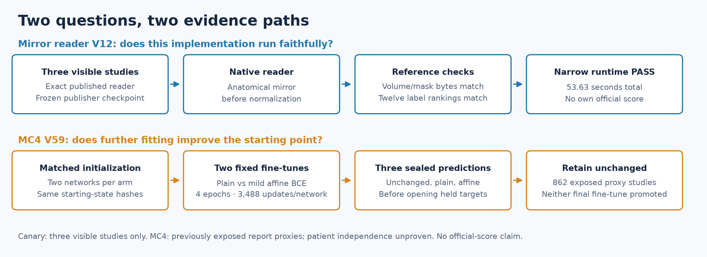
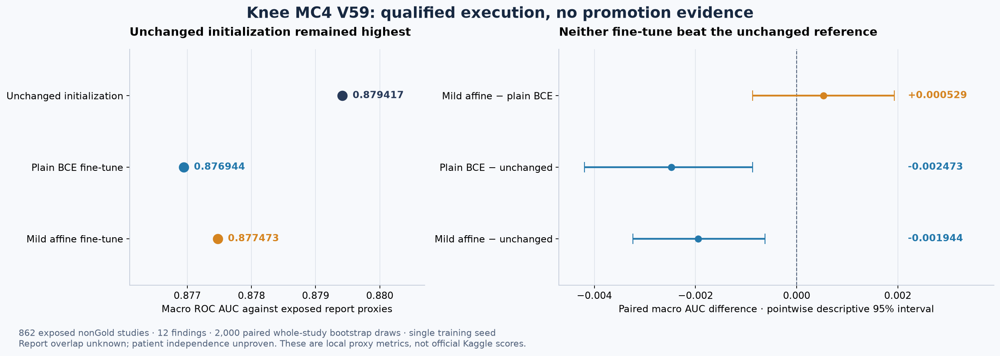

# Knee experiments: one runtime check passes, one training idea is rejected

The mirror reader completed real inference on three visible studies, with matching volume/mask bytes and twelve-label rankings. The MC4 training experiment also completed, but neither four-epoch fine-tune beat the unchanged initialization on its exposed report-proxy panel. We retain the unchanged reference.

This dated packet adds the measured outcomes to the earlier [mirror-reader release](../public-mirror-reader-2026-10-08/README.md) and [registered affine experiment](../native-paired-affine-2026-10-07/README.md). Their earlier entries remain an accurate record of what was known when published.



| Experiment | Measured result | What follows |
|---|---|---|
| Mirror reader, native V12 | Three visible studies; volume/mask byte parity; all twelve label rankings match; 53.63 seconds total native time | The narrow runtime check passes. Full inference and an exact completed official score are separate steps. |
| MC4 V59, plain BCE | Macro report-proxy AUC 0.876943525 | Below unchanged initialization: 0.879416982. Keep the trained checkpoints for diagnosis. |
| MC4 V59, mild affine BCE | Macro report-proxy AUC 0.877472933 | Mild minus plain is +0.000529408, with a pointwise descriptive interval crossing zero. No promotion. |



The three AUC values belong to an **already exposed 862-study, twelve-finding report-proxy panel**. Patient independence is unproven and report overlap is unknown. They are neither OOF validation nor clinical or official Kaggle scores. The upstream mirror notebook's displayed **0.949** remains credited to nartaa; this packet records no own new official score.

## Reproduce the published arithmetic

From the repository root, Python's standard library is enough to inspect the aggregate results and recompute every macro delta and its mean across twelve finding deltas:

```bash
python native-results-2026-10-08/tools/summarize_results.py
```

The script reads the hash-pinned [scalar evidence](evidence/aggregate_results.json). It does not load MRI, labels, models or study-level predictions, and does not reconstruct bootstrap samples from unavailable raw data.

To redraw the figures, use the versions in [requirements-figures.txt](requirements-figures.txt) and choose new output directories:

```bash
python native-results-2026-10-08/tools/plot_proxy_result.py --output-directory artifacts/knee-proxy-redraw
python native-results-2026-10-08/tools/render_evidence_flow.py --output-directory artifacts/knee-flow-redraw
```

For a real inference fork, start with the [original readable reader](../public-mirror-reader-2026-10-08/src/public_mirror_reader.py), [scientific contract](../public-mirror-reader-2026-10-08/SCIENTIFIC_CONTRACT.md) and [model-use instructions](../public-mirror-reader-2026-10-08/MODEL_USAGE.md). The native canary used that exact published reader SHA; it did not retrain the upstream checkpoint. Attach the original publisher's weights under their own terms.

Read [the native canary](MIRROR_CANARY.md), [the negative training result and next tests](MC4_NEGATIVE_RESULT.md), [figure provenance](FIGURE_NOTES.md) and [credits/license scope](CREDITS_AND_LICENSES.md). The [machine-readable provenance](PROVENANCE.json) preserves source/result hashes without distributing private engineering artifacts.
