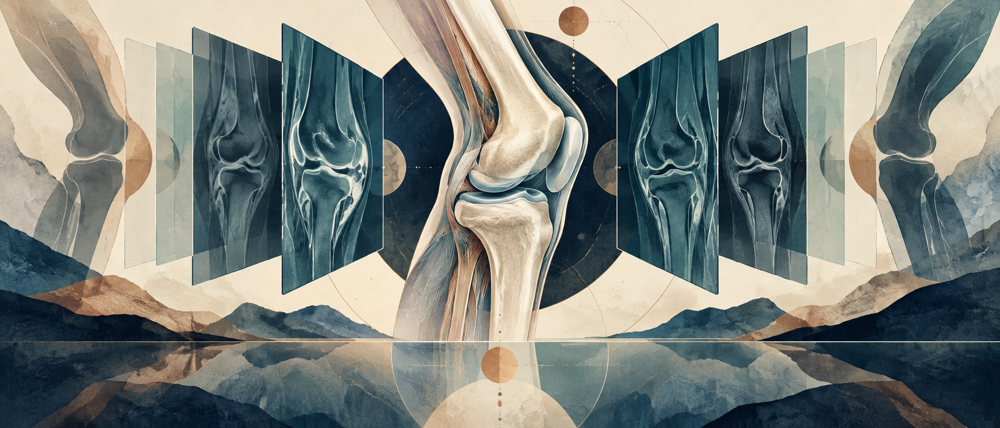
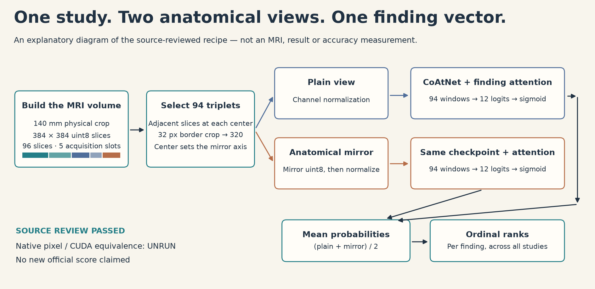

# Anatomical mirroring, explained and ready for a native canary



*AI-generated artistic illustration; not measured MRI data. [Artwork provenance](ARTWORK_PROVENANCE.json).*

An original, readable reader for the public **Raptor CoAtNet/MIL** recipe, with strict checkpoint hashes, explicit MRI geometry and outputs that preserve row order. Its purpose is to make one strong public method understandable and practical to experiment with.



The upstream [nartaa notebook V2](https://www.kaggle.com/code/nartaa/rsna-knee-0949-anatomical-mirror?scriptVersionId=356175397) displayed **0.949** when checked on 7 October 2026. That is **nartaa's public score**. This implementation has passed source/configuration checks and an independent mathematical review; **its native inference and official score are not yet verified**. It uses the same selected public checkpoint, so it is not a new independently trained model.

| Evidence | Status |
|---|---|
| Exact upstream scored version, source and checkpoint identity | Pinned in [PROVENANCE.json](PROVENANCE.json) |
| Original reader: syntax, geometry configuration, mirror-axis helper, inert import | Source checks passed in normal Python and `-O` |
| Healthy-input formulas and visible upstream recipe | Independent source review passed |
| Actual checkpoint deserialization, DICOM decoding and CUDA equivalence | **UNRUN** for this reader |
| Native canary, full test inference, runtime and peak GPU memory | **UNRUN** for this reader |
| Our new official competition score | **None** |

## What the method does

Each study becomes a 96-slice volume with five plane/sequence slots. It selects 94 adjacent three-slice windows, crops each image from 384 to 320 pixels, and asks one CoAtNet model for each finding. A finding-specific attention head pools the windows. The second view mirrors sagittal windows by reversing their acquisition channels and other windows by reversing image width. Mirroring occurs on `uint8` pixels **before** the three channel-specific normalization operations. We average the two probability vectors, then apply the upstream per-finding ordinal rank transform.

The [scientific contract](SCIENTIFIC_CONTRACT.md) explains the slot boundaries, equations, missing-acquisition behavior and differences from the upstream implementation. The [mirror diagram](figures/mirror_before_normalization_v2.png) highlights why the operation order matters.

## Fork and run a small canary

1. Accept the [RSNA Knee competition rules](https://www.kaggle.com/competitions/rsna-knee-abnormality-detection/rules) and use only data you are authorized to access.
2. Attach the original [selected SWA weights, version 1](https://www.kaggle.com/datasets/nartaa/rsna-knee-publication-swa-weights-20261007/versions/1). The reader checks the selected checkpoint's SHA-256 before loading it. This repository contains no weights or competition data.
3. Use a two-T4 CUDA environment. The scored upstream environment reported Python 3.13, Torch `2.11.0+cu128` and timm `1.0.29`; the original reader itself requires Python 3.11 or later and checks two T4 GPUs but does **not** enforce those library versions. Native compatibility still needs a canary. Required libraries are Torch, timm, NumPy, pandas, OpenCV and pydicom. Record their actual versions; do not infer a NumPy pin from the score.
4. Run the source checks, then run a three-study canary into a **fresh** output directory. Apply a wall-clock limit in your launcher; the reader has no internal hard watchdog. Start with a small budget and inspect the native receipt before allowing a full run.

```bash
python src/verify_mirror_reader_source.py --receipt source_checks.json
python -O src/verify_mirror_reader_source.py --receipt source_checks_optimized.json

python src/public_mirror_reader.py \
  --input-root /kaggle/input \
  --competition-root /kaggle/input/rsna-knee-abnormality-detection \
  --output-dir /kaggle/working/mirror_canary_001 \
  --mode canary --max-studies 3 --prep-workers 2
```

The competition path above is an example. Pass the actual directory containing `test.csv`, `sample_submission.csv`, `test_series.csv` and the mounted image directory. The input root must contain the attached original weights dataset. Canary outputs are `canary_predictions.csv`, `probabilities.npz` and `native_inference_receipt.json`. The receipt reports native completion only after all selected studies and file gates pass. A three-study rank output is a smoke test; it is not the full-test prediction file or an accuracy evaluation.

`probabilities.npz` and prediction CSVs contain study identifiers. Keep them in your authorized experiment workspace; do not publish them as repository examples. The reader never uploads, submits, trains, downloads a model or mutates a Kaggle notebook.

## Full inference after the canary passes

After checking actual versions, strict checkpoint loading, complete decoding, finite outputs, both views and the external time limit, run a separate full inference experiment. Use a fresh output directory to preserve the canary.

```bash
python src/public_mirror_reader.py \
  --input-root /kaggle/input \
  --competition-root /kaggle/input/rsna-knee-abnormality-detection \
  --output-dir /kaggle/working/mirror_full_001 \
  --mode inference --prep-workers 2
```

Full mode processes every test row and writes `submission.csv` with the exact sample schema and order. It does **not** submit that file. A notebook run, a valid CSV and an official scored submission are separate events; report any score only after its exact completed competition row is available. Full test runtime and GPU memory for this reader have not been measured.

For local experiments outside Kaggle, use the same authorized input layout, compatible two-T4 environment and mounted original checkpoint. CPU or single-GPU execution is not supported by this version. Tune one choice at a time—normalization, window selection, pooling or augmentation—and measure on a suitable independent validation split. Gold58 was reused for upstream selection and is not independent cross-validation.

## Credits and license boundaries

The selected checkpoint and anatomical mirror recipe are from **nartaa / Danial Zakaria**; the model and inference lineage are from **dreaddevelopment's Raptor** and **timm's CoAtNet**. The publisher credits weak-label work by **stevenleehans, pilkwang and riadmohamed42**, together with its report-derived targets. None of those source tables, reports or controlled-access records are in this packet.

Read [NOTICE.md](NOTICE.md) for full upstream acknowledgements, including the required NDA paragraph, [MODEL_USAGE.md](MODEL_USAGE.md) for the exact publisher permission and [LICENSE_SCOPE.md](LICENSE_SCOPE.md) before redistribution. The upstream source and this reader are Apache-2.0; new documentation, diagram tooling and source-check tooling are MIT. Checkpoints retain the publisher's separate **Other / research and educational model-use terms**. No repository license grants access to or redistribution rights over OAI data.
