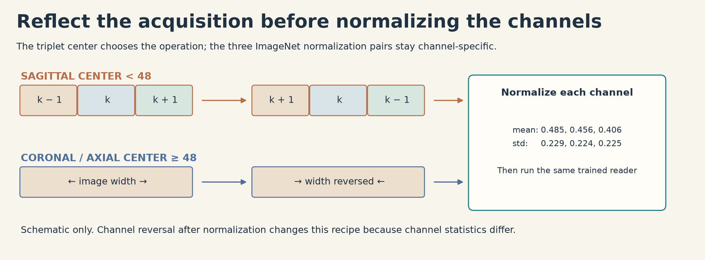

# Scientific contract: one checkpoint, two views

This describes the source-reviewed implementation, not a claim of native numerical equivalence or a new trained model. The exact public reference is nartaa V2, script version `356175397`.

## Acquisitions and intensity

| Slot | Source indices | Requested sequence | Slice count |
|---|---|---|---:|
| Sagittal | 0–25 | Fluid-sensitive | 26 |
| Sagittal | 26–47 | Non-fluid-sensitive | 22 |
| Coronal | 48–65 | Fluid-sensitive | 18 |
| Coronal | 66–77 | Non-fluid-sensitive | 12 |
| Axial | 78–95 | Any | 18 |

The reader takes the first suitable unused series in CSV order, preferring the requested sequence and otherwise using the first available series in the requested plane. Slice order projects `ImagePositionPatient` onto the cross product of the two `ImageOrientationPatient` vectors; `InstanceNumber` is the fallback. Apply the modality LUT, convert to float32, and invert MONOCHROME1 as max minus image.

Sample the series' 2–98% index span with linearly spaced, rounded indices. Repeated selections participate in the per-series 2nd and 98th pixel percentiles. For these bounds a and b, normalize each pixel as `clip((I-a)/(b-a+1e-6), 0, 1)`. The physical center crop uses `min(round(140 / max(spacing, .001)), height, width)` pixels, followed by area resize to 384 × 384 and truncating `uint8` quantization. This is a **140 mm** crop, not an arbitrary 140-pixel crop.

Missing slots remain zero padded in the same 96-slice layout. A completely absent or insufficient acquisition fails explicitly rather than returning model priors. Partial missing slots and windows crossing slot boundaries retain the reference recipe; no new cross-slot exclusion rule is introduced.

## Windows and mirroring

Take 94 evenly spaced, rounded centers from `first_nonzero_slice + 1` through `last_nonzero_slice - 1`. Each center k forms the adjacent triplet `(k-1, k, k+1)`. The center, rather than all three contributing slices, determines the mirror operation.

- For centers k < 48, reverse the three acquisition channels.
- For centers k ≥ 48, reverse image width.

Apply the chosen operation to uint8 windows. Then center crop 32 pixels from each image edge, giving 320 × 320. Normalize each channel using ImageNet means `(0.485, 0.456, 0.406)` and standard deviations `(0.229, 0.224, 0.225)`. Because channel statistics differ, swapping channels **after** normalization would change this recipe.



## Finding-specific multiple-instance learning

The backbone is `coatnet_rmlp_2_rw_384.sw_in12k_ft_in1k`, created for 320-pixel input, global average pooling, three channels and no classifier. Its weights are strictly loaded from the selected public checkpoint. In evaluation mode, extract features in chunks of 16 windows and apply LayerNorm.

For normalized feature f_k and finding c:

```text
a_kc = softmax over k [Linear_12(Tanh(Linear_256(f_k)))]
u_c  = sum over k (a_kc f_k)
z_c  = w_c · u_c + b_c
```

Dropout 0.2 belongs to the attention head but is disabled by model evaluation. CUDA autocast uses fp16 for model inference; logits are converted to float32 before sigmoid.

For the plain and anatomically mirrored views:

```text
p_ic = (sigmoid(z_plain,ic) + sigmoid(z_mirror,ic)) / 2
```

This averages **probabilities**, not logits. Across the processed studies, the final finding output is the upstream ordinal transform:

```text
ranks = probabilities.argsort(axis=0).argsort(axis=0)
y_ic  = ranks_ic / max(1, N-1)
```

The output is float32. Preserve the upstream NumPy `argsort` tie behavior; this is not a stable-tie or calibrated-probability claim. A canary's N differs from full inference, so its rank CSV must not be compared directly with a full-test rank CSV as proof of equivalence.

## Original engineering differences and unresolved checks

This module independently expresses the visible recipe. It replaces public fast-reader execution with readable DICOM preparation and bounded thread queues, rejects decode/nonfinite/model errors, requires usable acquisitions, preserves exact sample row order and creates output files without overwriting existing files. It uses tensor-only `torch.load(weights_only=True)`, which is stricter than the public reader. The checkpoint must actually pass this deserialization and strict state-dict gate in the native canary.

The source review compared healthy-input formulas and configuration. It did not execute the upstream fast reader, fetch weights, compare real pixel bytes, measure CUDA drift, prove throughput, complete hidden-test coverage or reproduce the public score. Matching visible formulas does not establish fast-reader byte identity or native prediction equivalence. The original reader has no hard watchdog: bound it externally and retain terminal receipts.
