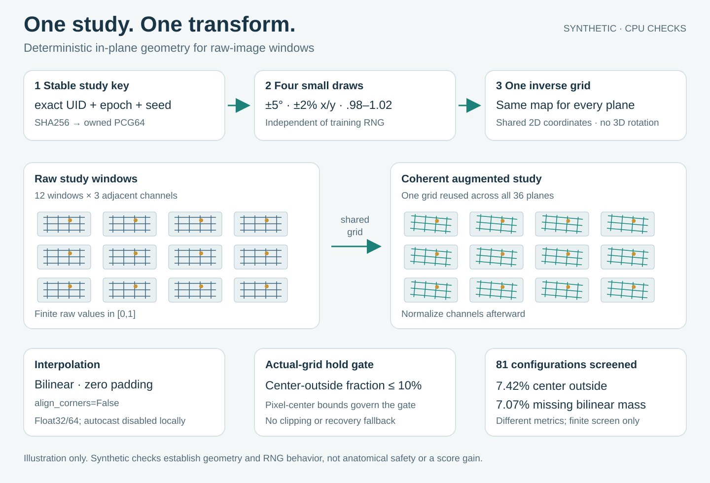

# Mild affine transforms that keep a study together

A small PyTorch helper for raw image windows that describe the same study.
One transform is shared across every window and adjacent channel, so changing
the geometry preserves the same coordinate mapping across those arrays. This
is a shared in-plane 2D transform across windows and channels; it does not
implement a physical 3D rotation. A dedicated
per-study, per-epoch PCG64 stream leaves shuffling, window sampling, and dropout
randomness alone.



The default input is `[B, 12, 3, 336, 336]`, with finite Float32 or Float64 values
in `[0,1]`. The caller applies channel normalization afterward. An explicit
`expected_study_shape` parameter supports other synthetic or independently
validated shapes; the default contract is strict.

## Run the checks

The supplied receipts use Python 3.12.14, NumPy 2.2.6, and CPU Torch 2.8.0.
`requirements-cpu-tested.txt` records these library versions. No downloads,
models, authentication, competition files, or real study IDs are needed.

From the repository root, with those libraries installed:

```bash
python -B tools/mild-study-affine/2026-10-06/verify_geometry.py
python -B -O tools/mild-study-affine/2026-10-06/verify_geometry.py
```

Both modes passed 27 named checks, including independent physical-pixel
geometry on rectangular images, impulse direction, window/channel coherence,
cross-process seed invariance, global RNG isolation, dtype and input refusals,
padding holds, and actual interpolation under outer autocast. The receipts
record exact source hashes and runtime versions.

The helper imports NumPy immediately and Torch only when tensors are applied.
The verifier uses Torch. Python 3.12.14 is the tested interpreter; other Python
versions depend on the installed library support and require fresh checks.
CPU correctness is the supplied execution evidence. CUDA requires
`synthetic_runtime_check` on the actual installed device before real data or
models; initialize CUDA before that check. MPS and XLA support are unverified.

## Use synthetic input first

This complete example runs from the repository root. The strings are invented
UIDs and the ramp contains no medical image data.

```python
import sys
import torch

sys.path.insert(0, "tools/mild-study-affine/2026-10-06")
from mild_affine import apply_study_batch, synthetic_runtime_check

print(synthetic_runtime_check("cpu"))
plane = torch.linspace(0, 1, 336 * 336).reshape(1, 1, 336, 336)
raw = plane.expand(12, 3, 336, 336).clone().unsqueeze(0)
augmented = apply_study_batch(
    raw, ["synthetic-study"], epoch=1, run_seed=2026100623
)
assert augmented.shape == raw.shape
# Apply the caller's chosen channel normalization to augmented afterward.
```

For real uint8 images, construct raw values with `images.float()/255` before
calling the helper. Use the exact same UID strings, epoch, and experiment seed
for models that should see the same study view. A repeated UID within an epoch
deliberately repeats its transform.

## Frozen transform and randomness contract

The four uniform draws occur in this order:

| Parameter | Range | Meaning |
| --- | --- | --- |
| angle | -5 to +5 degrees | Positive is clockwise in image coordinates |
| horizontal translation | -.02 to +.02 | Fraction of image width |
| vertical translation | -.02 to +.02 | Fraction of image height |
| scale | .98 to 1.02 | Magnification about the image center |

With x pointing right and y down, define coordinates relative to
`((W-1)/2,(H-1)/2)`. The forward physical-pixel map is
`q_out = scale * [[cos,-sin],[sin,cos]] * q_in + [tx*W,ty*H]`.
The helper supplies its inverse to Torch, including the H/W and W/H factors
needed for rectangular images. One grid per study is repeated across windows;
all channels use that grid. Sampling is bilinear, with zero padding and
`align_corners=False` in both grid generation and interpolation. There are no
flips.

The seed is the first 16 SHA256 digest bytes interpreted little-endian, from
`b"knee-mild-affine-pcg64-v1\x00"` followed by UTF-8 JSON of
`[run_seed, epoch, exact_uid]` using compact separators and `ensure_ascii=False`.
The owned PCG64 generator consumes exactly four uniform draws. Worker, network,
arm, batching, call order, Python hash randomization, and global RNG state do
not enter the key. Exact draw reproducibility is tied to the recorded NumPy
version; arbitrary future implementations are not promised identical floats.

## Padding and numerical limits

Every applied grid is checked against a center-outside fraction of **0.10**:
output centers whose inverse coordinates lie beyond source pixel-center
bounds `[0,W-1] × [0,H-1]`. The boundary comparison allows four dtype epsilons
for numerical edge rounding, about 0.0000801 physical pixel at 336 in Float32.

The finite 81-combination corner/intermediate screen at 336 square pixels gives:

| Quantity | Worst screened value |
| --- | ---: |
| source centers outside pixel-center bounds | 0.07421875 |
| source coordinates outside full pixel extent | 0.07071995464852608 |
| mean missing bilinear interpolation mass | about 0.070724693116751 |

These quantities differ. The 81-point screen is not a proof of the maximum
over all continuous parameter draws; the actual-grid gate remains required.

Grid creation and sampling disable autocast locally. The supplied CPU check
has exact parity under outer autocast. Zero treatment still passes through
interpolation: full-sized high-contrast Float32 identity error was
3.552436828613281e-5 against an explicit tolerance of 1e-4. It is not promised
bitwise identity. Float64 is checked independently.

Raw inputs must be strictly finite in `[0,1]`; Float16 and BFloat16 are refused
before interpolation. Output is also checked strictly in `[0,1]`, without
clipping. Runtime checks stress all 81 grids with saturated all-one and mixed
0/1 inputs. If an installed kernel produces even a rounding overshoot, it
raises `AffineHold` before training; investigate the kernel and contract rather
than add a silent fallback. Input and output bounds are validated per batch,
with device synchronization. This package supplies no throughput measurement.

Synthetic correctness does not establish anatomical safety, training benefit,
held-out generalization, or an official competition score. Those need separate
scientific validation.

## Files and provenance

`mild_affine.py` and `verify_geometry.py` are preserved byte-for-byte from their
reviewed standalone versions. `PROVENANCE.md` records their hashes, derivation,
primary API references, and evidence boundary. `MANIFEST.json` pins every
public file. Original code and diagrams in this directory use the MIT license;
dependencies and linked documentation retain their own licenses.

The SVG is illustrative, with screened values read from the supplied synthetic
receipt. Regenerate it into a new SVG path:

```bash
python -B tools/mild-study-affine/2026-10-06/render_pipeline.py --output /tmp/mild-affine-pipeline.svg
```

The renderer refuses to overwrite an existing output. Its inputs are the
synthetic receipt and local reviewed helper hash, and it uses only the Python
standard library.
