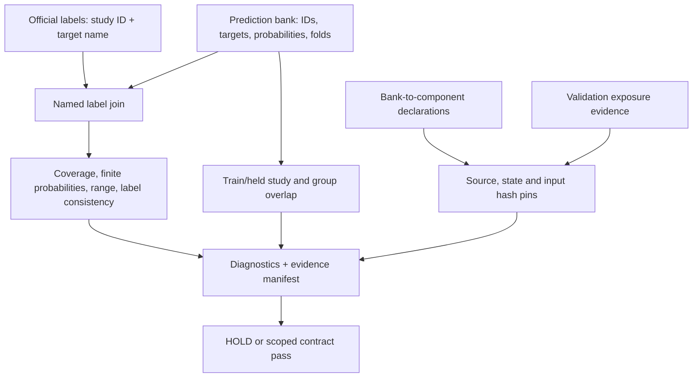

# OOF contract validator

Before comparing models, check that the predictions, labels and provenance actually belong together. This small utility joins by **study ID and target name**, checks the declared train/held splits, and binds each prediction bank to its generating components. It does no fitting and never changes its inputs.

It grew out of a concrete RSNA Knee failure: a historical NPZ's attached `y` array disagreed with the official labels in **145 of 696 Gold58 cells**. The separate B3 CSV matched all 696 cells. The same cohort had already been used to select blends, so correcting its label source would still leave it unsuitable as a fresh holdout. See [provenance and measurement limits](PROVENANCE.md).



## Try it

From this directory, using Python 3.12:

```bash
python -m venv .venv
source .venv/bin/activate
python -m pip install -r requirements.txt
python -m unittest -v test_oof_contract.py
python example.py
python example.py --mismatch
```

The first example produces `PASS_DATA_AND_DECLARED_PROVENANCE_ONLY`. The second introduces one synthetic label error, produces `HOLD` with `LABEL_MISMATCH`, and exits with code 2. Both retain a fresh evidence directory and print its path. Every example ID, probability, label and state is synthetic; no checkpoint or competition data is needed.

## Use your own bank

Import `Bank`, `Fold`, `Artifact` and `validate_contract` from `oof_contract.py`; `example.py` is a complete adapter to copy and change.

| Input | Contract |
|---|---|
| `official` | Study ID → target name → binary label; missing labels remain missing. |
| `Bank` | Explicit study IDs and target names, a numeric probability matrix, attached labels to compare, and each row's generating fold. Row and target permutations are allowed. |
| `Fold` | Actual training and held study IDs for that producing model. |
| `group_by_id` | Optional group identities, with `group_kind` stated explicitly. Report groups do not establish patient independence. |
| `Artifact` | Source/state/input/exposure file path and an independently retained expected SHA-256. A newly observed hash alone is reported as unpinned. |
| `components` | Required source, state and input artifact names for each model component. |
| `bank_components` | The generating components for every prediction bank. An unrelated model's provenance cannot cover another bank. |
| `exposure` | `exposed`, `attested_unexposed`, or unknown, with matching exposure artifacts. Unknown is never treated as untouched. |

Pin these contracts before validation. Use the complete producing model's train/held split and runtime receipts; avoid assigning another model's fold IDs to make an incomplete bank look complete. Supply official labels by their named columns rather than trusting an embedded `y` array.

The return value is JSON-compatible. Save it with `json.dump(report, file, allow_nan=False)` and use `format_diagnostics(report)` for readable diagnostics. Mismatch examples use hashed study IDs. The caller still controls its input data and any additional fields in the manifest.

## What a pass means

A pass means the supplied data and declared provenance contracts passed these checks. Runtime closure and untouched status remain explicit attestations: the utility cannot reconstruct an unknown training history from checkpoint hashes. It cannot establish patient identity, validate a missing generating component, prove leakage-free pretraining, certify an AUC gain, or establish equivalence to a current ensemble. `quality_promotion_authorized` is always false and `official_score` is always null.

The 20 tests cover swapped IDs/target order, fractional labels, missing labels, duplicates, missing studies, invalid probabilities, wrong shapes, train/group leakage, fold mismatches, missing or drifted artifacts, bank/component binding and validation exposure. Tested with Python **3.12.14** and NumPy **2.2.6**. Original implementation under the [MIT license](LICENSE).
