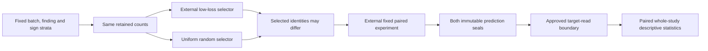

# Same support, different selected cells

Two small NumPy tools make a selection experiment easier to audit: a uniform
random mask with exact finding/class counts, and a descriptive paired AUC
bootstrap. The default verifier runs entirely on constructed arrays. It needs
an existing Python and NumPy installation, without Torch, models or private data.

```sh
python3 -B verify_numpy_methods.py
```

Run the verifier with assertions enabled. It explicitly refuses Python `-O`
and other optimized modes. It prints JSON and writes no files. Tested versions
and exact results are retained in `VERIFICATION_REPORT.json`.

```python
import numpy as np
from selection_controls import make_mask_generators, uniform_stratified_mask

# Rows are examples, columns are findings. True means soft target > 0.5.
signs = np.array([[False, True], [False, True],
                  [True, False], [True, False]])
streams = make_mask_generators(2026100521)
masks = [uniform_stratified_mask(signs, 0.8, stream) for stream in streams]
# In a paired peer experiment, student i receives masks[1-i].
```

Every nonempty finding/sign stratum retains `max(1, floor(retain * n))` cells.
An empty stratum keeps zero. This rule retains at least one even at `retain=0`.
With B4 and `retain=0.8`, a 2/2 class split retains 1/1: half the cells. Other
splits retain three cells. A B3 batch retains two cells. The nominal fraction is
therefore a rounding rule, not a guarantee of 80% exposure.

Each random selector has a dedicated PCG64 stream. Sampling uses a permutation
prefix without replacement; full-retention strata consume no random draws.
The tools do not alter global RNG state. Counts match the low-loss rule, while
selected identities can differ. Two masks can also coincide by chance. No
low-loss selector, neural model, trainer or native adapter is included.



The statistics function accepts caller-supplied arrays. The caller must establish
both prediction seals and the approved target-read boundary; the pure function
cannot attest to file seals itself. Here is an entirely synthetic example:

```python
from post_seal_statistics import paired_report_comparison

y = np.array([[0., 1.], [1., 0.], [0., 1.], [1., 0.]])
scores = np.array([[.2, .8], [.8, .2], [.3, .7], [.7, .3]])
result = paired_report_comparison(
    y, {"peer_selection": scores, "random_selection": scores},
    ["synthetic_a", "synthetic_b"], seed=2026100522, replicates=128,
)
assert result["peer_minus_random"] == 0.
```

Soft report targets are thresholded at `>0.5`; all findings need both classes.
The statistic averages finding AUCs equally. Each bootstrap draw resamples whole
study rows, using the same indices for both arms and every finding. A draw losing
either class for any finding is rejected jointly, with rejection counts reported.
The intervals therefore condition on class support. They are pointwise percentile
intervals, not simultaneous guarantees, patient-independent inference or
confirmatory evidence. Rare classes can exhaust the attempt limit and raise an
error. An optional monotonic deadline is checked before each resampling attempt;
it does not impose a hard timeout on preparation or individual array operations.

The intended campaign panel contains 128 previously exposed report-proxy studies.
These tools do not make that panel independent, clean its labels, establish
accelerator speed or demonstrate a competition score gain. Raw soft-label BCE
selection can prefer low-entropy targets even when predictions match them.
Matched random masks test which cells are selected while preserving support;
entropy-adjusted selection would be a separate experiment.

The two module files are exact copies of their original source-only proposal.
`PROVENANCE.json` records their lineage; `FILE_MANIFEST.json` records bundle
hashes. No executor, notebook metadata, checkpoints, real labels, study IDs or
private assets are distributed. Original source is available under the included
MIT license. Root review and a second-environment check are recorded in `ROOT_REVIEW.json`
and `SECOND_ENVIRONMENT_REPORT.json`.

Compatibility: Python 3.9+ and NumPy 1.22+ (the bootstrap uses the `method`
quantile argument). Tested environments are recorded in the reports.
